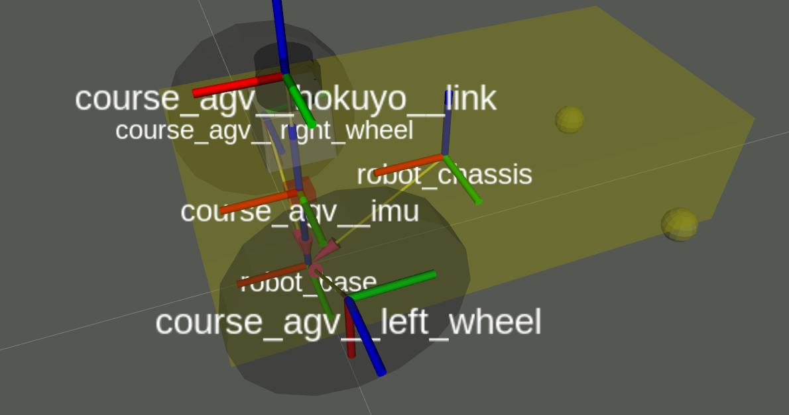

# 机器人学强化训练 -  移动机器人平台 & ROS

[TOC]
---
## 0.bash命令 [link](https://devdocs.io/bash/)

```bash
ls              # list files 
cd              # change directory
rm              # remove
mv              # move
export          # export variable
echom           # output 
whereis/which   # check path of binary file
mkdir           # make directory
touch           # make new file if non exist
cat             # get file contents
-------
help/--help
man
```

## 1.Installing and Configuring Your ROS Environment
> ROS Tutorials [link](http://wiki.ros.org/ROS/Tutorials)
* 依照[官方文档](http://wiki.ros.org/ROS/Tutorials/InstallingandConfiguringROSEnvironment)，我选择的是中科大的源
* 安装[catkin-tools](https://catkin-tools.readthedocs.io/en/latest/installing.html) : `apt install python-catkin-tools`
  * 更友好的编译输出
  * `catkin build`与`catkin_make_isolated`相似，允许并行编译

---

> 如果你使用了虚拟机，[这里](http://www.rawinfopages.com/tips/2017/07/speed-up-virtualbox-in-windows/)有一些tips可以尽量的加速你的虚拟机。以及：
>
> * 尽量打开3D加速
> * 如果没有打开3D加速的话，gazebo尽量缩小窗口大小，这样可以减少render带来了cpu占用。

---

* 可以参考的文件管理结构：
```
└── 'ROOT_DIR' or '~'
    ├── catkin_ws          # catkin workspace
    │   ├── build          #
    │   ├── devel          #
    │   │   └── setup.bash #
    │   └── src            # src -> ../catkin_ws_backup/XXX_ws_src
    └── catkin_ws_backup   # store packages | multi-workspace backup
```
* 可以简化你的常用命令` alias rs="source devel/setup.bash"`
* `$ROS_PACKAGE_PATH`

## 2.Navigating the ROS Filesystem

* package是ROS构建代码或者工程的基本单位(区分node)
* rospack, roscd, rosls
* Tab Completion

## 3.Creating & Building a ROS Package
* `catkin_create_pkg <package_name>`
* 修改pakcage.xml里面的配置
* CMakeLists (for c++ programming)
* TASK1：使用rosrun运行一个python脚本：将脚本放在`<your_package>/scripts`文件夹

> (python文件需要有执行权限)
```bash
catkin build
source devel/setup.bash
roscore 
# open another console
rosrun <package_name> <script_name.py>
```

## 4.Understanding ROS Nodes & Topic
* 进程通信
* Nodes: A node is an executable that uses ROS to communicate with other nodes.
* Messages: ROS data type used when subscribing or publishing to a topic.
* Topics: Nodes can publish messages to a topic as well as subscribe to a topic to receive messages.
* Master: Name service for ROS (i.e. helps nodes find each other)
* rosout: ROS equivalent of stdout/stderr
* roscore: Master + rosout + parameter server 

```bash
rostopic [echo|pub|list|hz|help|...]
rosnode [list|info|help|...]
rqt_graph
------------
rqt_plot
rosmsg [show]
```

## 5.了解tf [link](http://wiki.ros.org/tf)
* tf的作用
* 在ros中使用tf 



## 6.主要实验流程

* 需要用到的topic & tf

  | topic / tf | 类型 | 作用         |
  | ----- | ---- | ------------ |
  | /map  | [nav_msgs](http://docs.ros.org/api/nav_msgs/html/index-msg.html)/OccupancyGrid | 接收地图信息(障碍物) |
  | /scan  | [sensor_msgs](http://docs.ros.org/melodic/api/sensor_msgs/html/index-msg.html)/LaserScan | 接收激光雷达信息 |
  | /webService/cmd_vel  | [geometry_msgs](https://docs.ros.org/api/geometry_msgs/html/index-msg.html)/Twist | 发送AGV的速度信息 |
  | 待定 | [nav_msgs](http://docs.ros.org/melodic/api/nav_msgs/html/index-msg.html)/Odometry | 发送里程计信息 |
  | 待定 | [nav_msgs](http://docs.ros.org/melodic/api/nav_msgs/html/index-msg.html)/Path | 发送GlobalPlanner的路径 |
  | [target name] rviz 自定义 | [geometry_msgs](http://docs.ros.org/melodic/api/geometry_msgs/html/index-msg.html)/PoseStamped | 获取rviz上的target信息 |
  | **TF : **/map <-> /base_footprint | [tf](http://wiki.ros.org/tf/Tutorials/Writing%20a%20tf%20listener%20%28Python%29) | MAP坐标系 <-> AGV坐标系 |

* 熟悉AGV的系统(ubuntu 16.04)，设置AGV为ROS_MASTER，可以接收topic内容(rostopic echo [topicname]) [link1](http://wiki.ros.org/ROS/Tutorials/MultipleMachines) [link2](https://www.cnblogs.com/nicozhou/p/5693551.html)

* 熟悉rviz，将消息可视化到本地的rviz

* 书写代码完成相应实验

---
* 实验一 : GlobalPlanner + LocalPlanner
* 实验二 : Odometry
* 实验三 : Odometry + Planner联合


## -.其他有助于调试的工具

一些比较实用的小工具

* [git](https://git-scm.com/)                # 代码的版本管理软件（可以有效的防止代码丢失）
* [vim](https://www.radford.edu/~mhtay/CPSC120/VIM_Editor_Commands.htm)/[nano](https://www.nano-editor.org/)   # 远程登录只有终端的机器人时可能并没有GUI软件可以用来修改文本文件
* vnc              # 远程桌面


------

> [ZJUNlict](https://github.com/ZJUSSL/TeamDescription) - 小型足球机器人实验室[纳新](http://irzoyzno5hwwnpte.mikecrm.com/ozE0oHP)